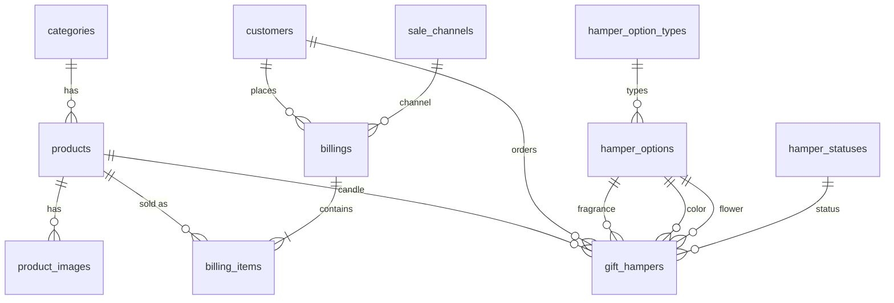

# Lumina Aura — Database Design & Normalization

This document describes the relational database derived from the Lumina Aura application model (`data/store.json`, `src/lib/types.ts`, `src/lib/store.ts`, `src/lib/hamper.ts`). The physical schema lives in `database/schema.sql`; sample rows matching the current JSON store are in `database/seed.sql`.

---

## 1. Why move from JSON to tables?

The app today persists everything in a single JSON file with three top-level arrays: `products`, `billings`, and `hampers`. That shape is convenient for a demo but creates classic relational problems:

| Issue in JSON | Example in Lumina Aura |
|---------------|-------------------------|
| **Repeating groups** (not 1NF) | `products[].images` is an array of URLs on one product row |
| **Redundant facts** | Category name `"Fresh"` stored on every product in that category |
| **Update anomalies** | Renaming a category requires editing many products |
| **Insertion anomalies** | Cannot record a `category` until a product uses it (unless duplicated) |
| **Derived data stored twice** | `price`, `discountPercent`, and `discountPrice` can drift if not recalculated together |
| **Duplicated customer data** | Same `customerName` / `customerEmail` copied on every billing and hamper |
| **Nested documents** | Each hamper embeds four mini-objects (`candle`, `fragrance`, `color`, `flower`) with overlapping keys |

Normalization splits this into tables so each fact is stored once, linked by keys, and constraints enforce integrity.

---

## 2. Normal forms (applied to this project)

### First normal form (1NF)

**Rule:** Each column holds atomic values; no repeating groups within a row.

**Before (JSON product):**

```json
{
  "id": "p-aurora",
  "category": "Signature",
  "images": ["/images/candle-1.svg", "/images/candle-1-b.svg"]
}
```

**After:**

- `products` — one row per candle SKU; scalar columns only.
- `product_images` — one row per image URL with `sort_order`.

**Hamper options:** Fragrance, color, and flower choices were hard-coded arrays in `hamper.ts`. They become rows in `hamper_options`, distinguished by `option_type` (`fragrance`, `color`, `flower`).

**Billings / hampers:** Nested `items[]` and embedded selection objects become separate child tables (`billing_items`, foreign keys on `gift_hampers`).

---

### Second normal form (2NF)

**Rule:** 1NF + every non-key attribute depends on the **whole** primary key (relevant when the key is composite).

**`billing_items`**

- Primary key: `id` (surrogate), or logically `(billing_id, line_number)`.
- Attributes like `quantity`, `unit_price`, and `line_total` depend on the full line identity, not on part of a composite key alone.
- `product_id` identifies *which* SKU was sold; line-specific values (`quantity`, prices at sale time) belong on the line row.

**`product_images`**

- `(product_id, sort_order)` uniquely identifies an image slot; `url` depends on that pair.

**`gift_hampers`**

- Each hamper has one candle product and one choice per option type; selection IDs and charged prices are attributes of the hamper header (single PK `id`), so there is no partial-key dependency.

---

### Third normal form (3NF)

**Rule:** 2NF + no non-key attribute depends on another non-key attribute (no transitive dependencies).

| Transitive dependency (removed) | Normalized design |
|--------------------------------|-------------------|
| `product.category` → category name repeats | `products.category_id` → `categories.name` |
| `product.discountPrice` → function of `price` and `discountPercent` | `products.list_price` + `discount_percent`; `sale_price` is a **generated column** |
| `billing.channel` string literals | `billings.channel` → `sale_channels.code` |
| `hamper.status` string literals | `gift_hampers.status` → `hamper_statuses.code` |
| Customer name/email on every order | `customers` table; `billings.customer_id`, `gift_hampers.customer_id` |

**Mapping from TypeScript types:**

| Application type | Tables |
|------------------|--------|
| `Product` | `products`, `categories`, `product_images` |
| `Billing` + `BillingItem` | `billings`, `billing_items`, `customers`, `sale_channels` |
| `GiftHamper` + `HamperSelection` | `gift_hampers`, `hamper_options`, `products`, `customers` |
| `HamperOption` (constants) | `hamper_options`, `hamper_option_types` |
| Packaging fees | `fee_types` (current amounts); copied onto `gift_hampers` at order time |

---

### BCNF and practical exceptions

**Boyce–Codd normal form (BCNF):** Every determinant is a candidate key. The schema is largely in BCNF for catalog and lookup tables.

**Intentional denormalization (still 3NF on the line PK):**

Invoice and hamper flows **snapshot** catalog text and prices at order time (same as `createBilling` and `createHamper` in `store.ts`):

- `billing_items.product_title`, `product_code`, `unit_price`, `line_total`
- `gift_hampers.candle_price_charged`, `fragrance_price_charged`, etc.

These values depend only on the billing line or hamper row’s primary key, so they remain **3NF**. They duplicate catalog data **on purpose** so historical invoices stay correct if a product is renamed or repriced later. That is standard for order/invoice models, not a normalization failure.

---

## 3. Entity-relationship overview



---

## 4. Table reference

### Catalog

| Table | Purpose | PK |
|-------|---------|-----|
| `categories` | Product group names (Signature, Floral, …) | `id` |
| `products` | Candle SKUs, inventory, pricing inputs | `id` (text slug, matches app) |
| `product_images` | Ordered gallery URLs | `id` |

**Note:** App field `price` → column `list_price`; app `discountPrice` → computed `sale_price` (equivalent to `product.discountPrice` when percent is in sync).

### Hamper builder

| Table | Purpose |
|-------|---------|
| `hamper_option_types` | fragrance / color / flower |
| `hamper_options` | Selectable add-ons (from `FRAGRANCE_OPTIONS`, `COLOR_OPTIONS`, `FLOWER_OPTIONS`) |
| `fee_types` | Global fees (`PACKAGING_BASE_FEE`, `LOGO_PACKAGING_FEE`) |

### Sales

| Table | Purpose |
|-------|---------|
| `customers` | Contact identity reused by billings and hampers |
| `billings` | Invoice header (`invoice_number`, totals, channel) |
| `billing_items` | Line-level qty and amounts |
| `gift_hampers` | Custom hamper orders with FKs + price snapshots |

### Lookups

| Table | Values |
|-------|--------|
| `sale_channels` | `online`, `offline` |
| `hamper_statuses` | `pending`, `confirmed`, `fulfilled`, `cancelled` |

---

## 5. Column mapping (JSON → SQL)

### Product (`store.json` → `products` + related)

| JSON field | SQL |
|------------|-----|
| `id` | `products.id` |
| `title`, `description`, `code` | same names (code → unique) |
| `price` | `list_price` |
| `discountPercent` | `discount_percent` |
| `discountPrice` | `sale_price` (generated) |
| `stock`, `scent`, `burnTime`, `featured` | `stock`, `scent`, `burn_time`, `featured` |
| `category` | `categories.name` via `category_id` |
| `images[]` | `product_images.url` |
| `createdAt`, `updatedAt` | `created_at`, `updated_at` |

### Gift hamper (`store.json` → `gift_hampers`)

| JSON path | SQL |
|-----------|-----|
| `id`, `reference`, `notes`, `status`, `createdAt` | header columns |
| `customerName`, `customerEmail`, `customerPhone` | `customers` + `customer_id` |
| `candle.productId` | `candle_product_id` |
| `candle.price` | `candle_price_charged` |
| `fragrance.id` / `price` | `fragrance_option_id`, `fragrance_price_charged` |
| `color.id` / `price` | `color_option_id`, `color_price_charged` |
| `flower.id` / `price` | `flower_option_id`, `flower_price_charged` |
| `packagingFee`, `logoFee`, `total` | same (numeric) |
| `logoUrl` | `logo_url` |

Labels (`label` on each selection) are not stored on the hamper row; they can be joined from `hamper_options` and `products` for display, while charged amounts remain on the hamper for audit.

### Billing (empty in seed JSON; shaped by `createBilling`)

| App field | SQL |
|-----------|-----|
| `invoiceNumber`, `channel`, totals, `notes`, `createdAt` | `billings` |
| `customer*` | `customers` |
| `items[]` | `billing_items` with snapshot title/code |

---

## 6. Integrity rules mirrored from application logic

- **Stock:** Decremented on billing lines and hamper candle selection (enforce in transactions in the app layer; optional `CHECK` triggers can guard negative stock).
- **Hamper pricing:** `total` should equal sum of charged components + `packaging_fee` + `logo_fee` (validate in app or add a `CONSTRAINT` with a trigger).
- **Option types:** Each FK on `gift_hampers` should reference an option of the correct `option_type` (enforce with triggers or application validation).

---

## 7. How to create the database

Requires PostgreSQL 14+ (for `gen_random_uuid()` and generated columns).

```bash
createdb lumina_aura
psql -d lumina_aura -f database/schema.sql
psql -d lumina_aura -f database/seed.sql
```

Verify products and sale prices:

```sql
SELECT id, title, list_price, discount_percent, sale_price
FROM products
ORDER BY id;
```

Verify hampers with joined labels:

```sql
SELECT gh.reference, p.title AS candle, f.label AS fragrance, gh.total
FROM gift_hampers gh
JOIN products p ON p.id = gh.candle_product_id
JOIN hamper_options f ON f.id = gh.fragrance_option_id;
```

---

## 8. Normalization summary

| Normal form | What we fixed in Lumina Aura |
|-------------|------------------------------|
| **1NF** | Split image arrays and nested JSON objects into separate rows/tables |
| **2NF** | Line items and images keyed correctly on composite/surrogate keys |
| **3NF** | Categories, channels, statuses, and customers factored out; removed stored derived `discount_price` |
| **Documented exception** | Invoice/hamper price and product title snapshots for historical accuracy |

This schema supports the same features as the Next.js app—catalog, admin inventory, online/offline billings, and custom gift hampers—while giving you referential integrity, queryable reports, and a clear path to replace `data/store.json` with a real database when you wire an ORM or SQL client.
